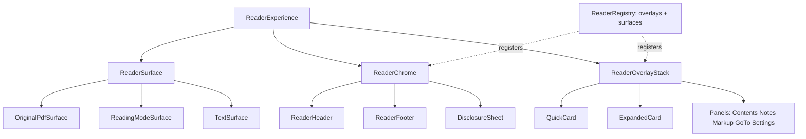

# Mobile Reader + Home Experience Redesign

**Date:** 2026-10-03 · **Role:** Investigator / Planner · **Status:** Design contract — no production code changed

**Objective:** Reset the *presentation layer* of the Reader and Home. The document/PDF/OCR/lookup
architecture is correct and must survive untouched.

**Evidence standard used throughout:**

| Tag | Meaning |
|---|---|
| **FACT** | What the repository or reference actually does, with file:line or source path. |
| **INTERPRETATION** | The design principle reasonably inferred from that evidence. |
| **RECOMMENDATION** | What Context Lens should consider, with the tradeoff named. |

---

## 1. Executive summary

**FACT.** The Reader presentation layer has drifted into a state where four separate mechanisms
compete to reveal, hide, or dock chrome, and three separate mechanisms handle Back.

| Mechanism | Location | Concern |
|---|---|---|
| `.reader-shell` `chrome-quiet` | `src/reader/ReaderShell.tsx:7-11,71-79` | Scroll-capture + tap/flick classifier + quiet state |
| `.reader-fab` dim/expand timer | `src/reader/ReaderFab.tsx:19,28-29,37-38` | Independent 2s dim + scroll/pointer listeners |
| `.reader-reveal` button | `src/reader/ReaderShell.tsx:92` | A *third* reveal affordance ("Aa ···") |
| `ReaderProgress` portal host | `src/app/App.tsx:613` → `src/reader/pdf/PdfViewer.tsx:81-84` | Viewport reaches into chrome DOM by class name |

**FACT.** The mode switch is exposed **twice** — once as a `ReaderToolbar` icon button
(`src/app/App.tsx:595`, `mode` / `onModeSwitch`) and once as the `PdfModeSwitch` segmented group
(`src/reader/pdf/PdfModeSwitch.tsx:33-36`). **FACT.** `ReaderFab` and the toolbar `More` menu both
offer Notes, Markup, and Text-and-theme (`src/reader/ReaderFab.tsx:17` vs
`src/reader/ReaderToolbar.tsx` `More` menu).

**FACT.** An incremental patch of exactly this kind has already been attempted and is **still
uncommitted in the working tree**: `src/reader/ReaderFab.tsx` is a new untracked file, 11 files are
modified, and `docs/tasks/2025-10-03-mobile-reader-header-fab-redesign-handoff.md` records the
result as *"In progress — CSS/TSX implemented, E2E failing, unit tests stale"* with
`PdfModeSwitch` disappearing from the DOM and Playwright timing out at ~120s.

**INTERPRETATION.** The failure is not a bug in the FAB. It is that the FAB was added as a fifth
answer to a question the shell never resolved: *where do secondary actions live on a phone when
the chrome is hidden?* Every new affordance re-opens that question and adds its own state machine,
its own dismissal rule, and its own tests. This is why the same work regresses.

**RECOMMENDATION.** Replace the chrome model rather than patch it. One disclosure mechanism, one
Back priority stack, one place that owns chrome visibility. Retire `ReaderFab`. Split `PdfModeSwitch`
along its own concern seams. Move reader presentation state out of `App.tsx` into a
`ReaderExperience` boundary — without rewriting `App.tsx` in this task. Preserve the document model,
location model, offset model, OCR supplementation model, and local-first lookup pipeline **exactly**.

---

## 2. Current architecture findings

### 2.1 What is already correct and must not change

**FACT.** `docs/ARCHITECTURE.md` invariants that constrain this redesign:

| # | Invariant | Source | Consequence for the redesign |
|---|---|---|---|
| 1 | One `DocumentRecord` + one `PdfDocumentLocation` across both PDF modes; `changePdfViewMode` recomputes the location | `src/app/App.tsx` | Original ↔ Reading is a **presentation** switch, not a document switch. The new model must express it that way. |
| 2 | `structuredPages.ts` is the single page-model source | — | Chrome must not derive pages. |
| 3 | Offsets are canonical; normalization is for alignment only | — | Highlights/notes survive any presentation reset. |
| 4 | OCR supplements, never replaces (`db.pdfOcr`, `ocrKey`) | — | OCR must stay a *source toggle*, not a mode. |
| 5 | Lookup is local-first / cache-first | — | Quick Card must render from cache without a network round-trip. |
| 7 | Failures degrade safely | — | Offline must not remove controls, only data. |
| 8 | AI context is explicit opt-in | — | Escalation stays behind a separate, ownable gesture. |
| 10 | Bundle discipline — PDF.js/Tesseract stay lazy chunks | — | Any new control must not statically import an engine. |
| 11 | No silent reload on update | — | `updateReady` banner pattern stays. |

**FACT.** `LookupBottomSheet.tsx:142-148` contains a selection/result **identity guard** — a result
whose `result.selection.surface` does not match `selectionText` is dropped, so a result belonging to
a previous selection can never be painted while a new lookup is starting. This is a correctness
behavior, not styling, and must survive verbatim.

**FACT.** `PdfReadingView.captureSelection` deliberately ignores events inside `[data-ocr-page]`.
OCR text therefore cannot feed lookup through native selection. The contextual-reading contract must
account for this rather than assume OCR selection works.

### 2.2 ReaderShell — architectural question 1

**FACT.** `ReaderShell.tsx` is not the renderer or the scroll owner. It owns exactly one piece of
state — transient mobile chrome visibility (`quiet`) — and renders the toolbar, footer, overlays and
the FAB.

**FACT.** It does however own four unrelated concerns:

1. **Gesture thresholds** — `TAP_MS = 450`, `TAP_SLOP = 10`, `QUIET_TRAVEL = 32` (lines 7-10).
2. **A tap-vs-flick classifier** — `pointerdown/move/up/cancel` on `host` with capture (lines 72-74).
3. **A scroll listener on `document` with `capture: true`** (line 71) so it can see inner scrollers.
4. **A hardcoded string list of other components' class names** (line 11):

```ts
const OVERLAY_OPEN = '.reader-more-menu,.pdf-reading-options,.pdf-more-menu,' +
  '.pdf-reading-selection-wrap,.pdf-reading-selection-actions,.selection-actions';
```

**FACT.** That single constant couples `ReaderShell` to four other modules by CSS class name:
`ReaderToolbar` (`.reader-more-menu`), `PdfModeSwitch` (`.pdf-reading-options`), `PdfReadingView`
(`.pdf-reading-selection-wrap`, `.pdf-reading-selection-actions`), and `LookupBottomSheet`
(`.selection-actions`). It also knows surface-specific selectors (line 23):

```ts
const readingSurface = surface === 'original' ? '.pdf-page' : '.pdf-reading-scroll';
```

**INTERPRETATION.** Overlay detection by class-name matching is the structural cause of the brittleness
the prior handoff documented. If `ReaderToolbar` stops rendering `{children}`, `PdfModeSwitch` leaves
the DOM, and this constant silently stops matching — with no type error, no build error, and only a
120-second Playwright timeout as a symptom.

**FACT.** The shell also renders a third reveal affordance (line 92):

```tsx
{quiet && <button class="reader-reveal" aria-label="Show reading controls" onClick={() => setQuiet(false)}>Aa &#183;&#183;&#183;</button>}
```

**INTERPRETATION.** So mobile currently has **four** chrome surfaces — header, footer, FAB, and a
reveal button — plus the FAB's own dim state. That is the opposite of a quiet reading surface.

### 2.3 ReaderToolbar — architectural question 2

**FACT.** `ReaderToolbar.tsx` renders: back, document title, a **permanently disabled Search button**,
a PDF mode toggle, a `children` slot, a `primaryActions` slot, an appearance button, and a `More`
menu mixing seven unrelated concerns — Document/Contents, Context panel, Notes, Markup, Text and
theme, Language engines, OCR next. `App.tsx:595` passes `primaryActions={null}`.

**INTERPRETATION.** Three separate defects: a dead control (Search) that costs a slot and reads as a
broken app; a mode control that duplicates `PdfModeSwitch`; and a `More` menu that is not "more" but
"everything", which destroys the progressive-disclosure model the mobile contract requires.

### 2.4 ReaderFab — architectural question 3

**FACT.** `ReaderFab.tsx` is **untracked and new**. It expands into Markup / Notes / Text-and-theme /
Form-fill (Original only).

**FACT.** It manages state that the shell already manages:

```ts
const [dimmed, setDimmed] = useState(false);          // line 19
const dimTimer = useRef<number | null>(null);          // line 22
dimTimer.current = window.setTimeout(() => setDimmed(true), 2000);   // line 29
document.addEventListener('scroll', onScroll, { passive: true, capture: true });  // line 37
document.addEventListener('pointerdown', onPointerDown, { passive: true });        // line 38
```

**FACT.** It hides entirely when `lookupOpen` is true (`App.tsx:599`), so its identity changes
depending on unrelated state. **FACT.** `App.tsx:599` wires `onFormFill={() => {}}` — a no-op.

**FACT.** `ReaderFab` is rendered **only for PDFs**:

```tsx
{documentRecord.kind === 'pdf' && currentLocation.kind === 'pdf' && <ReaderFab … />}
```

So text, Markdown and EPUB readers have **no** mobile secondary-action surface at all. The FAB
solves a problem for one format and leaves three formats without one.

**INTERPRETATION — what problem was the FAB introduced to solve?** On a phone, when chrome is hidden,
there is no reachable path to Notes, Markup, or Typography. The FAB was a direct answer: float a
persistent button that re-opens those actions. That problem is real. But the FAB answers it by
creating a second, independent chrome state machine, a second dismissal rule, a per-format
availability cliff, and — per the uncommitted handoff — a second Back mechanism via
`history.pushState`/`popstate`.

**RECOMMENDATION.** Retire `ReaderFab`. Solve the same problem with **one** disclosure mechanism: a
single bottom sheet reachable from one always-available place, at any chrome state. Tradeoff: the FAB
is one tap to the actions; a sheet is two. Mitigation: put the sheet trigger in the *footer*, which
stays reachable in quiet mode, so the cost is still one tap from anywhere.

### 2.5 App.tsx — architectural question 4

**FACT.** `App.tsx` is 620 lines with ~48 `useState` declarations (lines 74-122). Reader presentation
state that has no business at the app root:

| Line | State | Natural owner |
|---|---|---|
| 101 | `contentsOpen` | ReaderOverlay |
| 102 | `contextPanelOpen` | ReaderOverlay |
| 103 | `goToOpen` | ReaderOverlay |
| 85 | `showReaderSettings` | ReaderOverlay |
| 86 | `highlightToolsOpen` | ReaderOverlay |
| 92 | `lookupOpen` | ReaderOverlay |
| 98 | `originalClickLookup` | ReaderSurface (PDF) |

**FACT.** These are collapsed into a single 7-term OR at `App.tsx:593`:

```tsx
controlsLocked={lookupOpen || showNotes || showReaderSettings || showApiSettings ||
                goToOpen || highlightToolsOpen || activeMarkupTool !== null}
```

**INTERPRETATION.** Adding any new overlay means editing this OR at the app root. That is a
`SHARED_CONTRACT`-level coupling for what should be local presentation detail, and it is why overlay
work keeps colliding with chrome work.

**FACT.** Reader-related effects scattered through `App.tsx` encode overlay precedence ad hoc:
line 144 (`!desktop && (lookupOpen || showNotes) → setContentsOpen(false)`), line 264, line 268
(`contextPanelOpen || lookupOpen || showNotes → closeContext`). This *is* a Back/priority model —
spread across three call sites instead of one.

### 2.6 PdfModeSwitch — architectural question 5

**FACT.** `PdfModeSwitch.tsx` is 17 props and mixes five concerns in one component:

| Concern | Lines |
|---|---|
| Original / Reading presentation mode | 33-36 (`role="group"`, `aria-pressed`) |
| Text source (PDF vs OCR) | 44-45 |
| OCR language | 46 (`aria-label="OCR language"` select) |
| OCR queue lifecycle (pause/continue/cancel/status) | 49-58 |
| OCR result management (clear) | 60 |

**FACT.** Labels are hardcoded Vietnamese inside an otherwise i18n-aware component
(`'Chữ PDF'`, `'Chữ OCR'`, `'Ngôn ngữ OCR'`, `'Nhận dạng chữ trang này'`, `'Tạm dừng OCR'`,
`'Tiếp tục OCR'`, `'Hủy OCR'`, `'Xóa kết quả OCR của tài liệu'`) while the same file uses the
`uiLanguage === 'vi' ? … : …` pattern for every other string. Lines 49-51 and 60 have no English
variant at all.

**FACT.** Completion is detected by string match (line 31):

```ts
const done = queueStatus?.state === 'done' && queueStatus.message === 'Không còn trang cần OCR.';
```

**FACT.** The busy indicator is `<span class="pdf-tools-busy" />` — a decorative dot with no
accessible label and no `role="status"`.

**INTERPRETATION.** The brief's suspicion is confirmed exactly. One component holds a presentation
mode, a source selector, a language selector, a queue controller, and a destructive action — and
because they are in one popover they read as one concept, which is why "OCR next" also had to be
duplicated into the toolbar `More` menu to be reachable on mobile.

### 2.7 Home

**FACT.** `App.tsx:504-580`. The simple-mode Home is a single vertical stack:

1. `brand-header` + `home-nav` — 4 buttons (Saved words, Storage, Settings, Guide) + `LookupStatistics`
   + `LanguageToggle` + a Simple/Advanced density toggle + an Appearance select
2. `home-preferences` / `home-intro` with 3 anchor links
3. `primary-actions` div — `PasteComposer` **first**, then `#import-document`
4. `continueReadingSection` — a default-closed `<details>` nested inside `<section class="continue-section">`
5. `#library` section — search, kind filter, grid, load-more
6. `OnboardingCard`, `home-note`

**INTERPRETATION.** The stated hierarchy is Import-primary / Paste-secondary, but the DOM order makes
Paste first and Import the second card. Paste, Import, Library, Typography and Storage each appear in
**two or three** places (nav, intro anchors, action cards). `ContinueReading` is double-nested
(`<details>` inside `<section>`), so its disclosure state and its section semantics are conflated.

### 2.8 CSS

**FACT.** `src/styles.mobile-reader.css:5` defines
`--reader-header-height: calc(56px + env(safe-area-inset-top))`. `src/reader-layout.css:9-10` defines
`--reader-fab-size: 48px; --reader-fab-gap: 16px`.

**FACT.** The mobile sheet uses heavy double-class specificity —
`.reader-shell.reader-shell .reader-fab`, `.reader-shell.reader-shell .reader-header` — to win over
`reader-layout.css`, which is loaded *before* it. This is a specificity war, not a cascade design.

**FACT.** `styles.mobile-reader.css:80`:

```css
.reader-shell.reader-shell[data-reader-surface="original"].chrome-quiet .reader-progress {
  transform: none; opacity: 1; pointer-events: auto;
}
```

The footer **stays visible in Original** while the header quiets — an asymmetric rule with no stated
rationale.

**FACT.** `styles.mobile-reader.css` uses breakpoints 767px and 1023px; `docs/ui-system.md` invariant 1
names `useDesktop()` (`min-width: 1024px`) as the single responsive authority.

### 2.9 Test coupling

**FACT.** Layout-coupled assertions found across the E2E suite:

| File | Evidence |
|---|---|
| `e2e/pdf-mode-layout.spec.ts` | reads `--reader-header-height` CSS var; 8 bounding boxes; `classList.add/remove('chrome-quiet')` at lines 81, 91; rewrites the mode-switch selector per viewport |
| `e2e/pdf-mobile-chrome-space.spec.ts` | `classList.remove/add('chrome-quiet')` at lines 13, 36, 48 |
| `e2e/pdf-click-mobile.spec.ts` | bounding boxes for `.reading-percentage`, `.pdf-click-toggle`, `.pdf-page-slot`; `getComputedStyle(card).position/transform`; asserts `.reader-shell` matches `/chrome-quiet/` |
| `e2e/homepage.spec.ts` | 17 layout assertions — `border-radius` `0px`/`16px`/`12px` on 7 elements; `font-size` `18px`/`23px`; `font-family` |
| `e2e/continue-reading.spec.ts` | `(await list.boundingBox()).height <= 324` |
| `e2e/quick-placement.spec.ts` | `width toBe(440)`, `left: '148px'`, `x toBeCloseTo`, `y >= 72` |

**FACT.** A strong semantic pattern already exists and should be the target:
`getByRole('button', {name:'Back to library'})`, `{name:'Close meaning'}`, `{name:'Plain text'}`,
`{name:'Advanced'}`, `{name:'Typography'}`, `getByLabel('Appearance')`,
`getByRole('progressbar', {name:'Reading progress'})`, `getByRole('menuitem', …})`,
`getByRole('dialog', {name:'Markup tools'})`.

**FACT.** `scripts/check_architecture_contracts.mjs:92` only checks chunk-name prefixes
(`pdf-reader`, `ocr-reader`, `epub-reader`, `docx-reader`, `archive-runtime`). **No UI/chrome
structural contract is guarded today**, so a chrome reset has no automated backstop other than tests.

---

## 3. Reference research

### 3.1 KOReader — PDF/document interaction

**FACT.** PDFs render through **MuPDF**; `CreDocument` is a *different* engine for EPUB/DOCX/TXT
(`frontend/document/credocument.lua:1-4`). All PDF work is delegated to `koptinterface.lua`.

**FACT — zoom is a genus × type factorization, not an enum** (`frontend/apps/reader/modules/readerzooming.lua:20-64`):

```lua
available_zoom_modes = { "page","pagewidth","pageheight",
                         "content","contentwidth","contentheight",
                         "columns","rows","manual" },
zoom_genus_to_mode  = { [4]="page", [3]="content", [2]="columns", [1]="rows", [0]="manual" },
zoom_type_to_mode   = { [2]="", [1]="width", [0]="height" },
DEFAULT_ZOOM_MODE = "pagewidth",
```

**INTERPRETATION.** "Fit to page" and "fit to content" are *the same mode family over a different
source rectangle*, not two features. Context Lens already has this implicitly (fit-width vs natural)
but expresses it as a single enum.

**FACT.** The default genus is `3` = **content**, not page — autocrop is the default. **FACT.** The
pipeline order is crop → zoom → margin; `page_margin` help text: *"Set margins to be applied after
page-crop and zoom modes are applied."*

**FACT — pinch maps to page, spread maps to content:**

```lua
function ReaderZooming:onPinch(arg, ges)
  if ges.direction == "diagonal" then self:genSetZoomModeCallBack("page")() …
```

**FACT.** Auto-crop has a degenerate-result guard: if `(x1-x0)/w > 0.1 or (y1-y0)/h > 0.1` accept,
else fall back to the full page box. Threat model per help text: *"speckles or fingerprints in the
margins."*

**FACT — the whole OCR decision is one function** (`koptinterface.lua:getTextBoxes`):

```lua
local text = doc:getPageTextBoxes(pageno)
if text and #text > 1 and doc.configurable.forced_ocr ~= 1 then
  return text            -- use the embedded text layer
else
  if doc.configurable.text_wrap == 1 then return self:getNativeTextBoxes(doc, pageno)
  else return self:getNativeTextBoxesFromScratch(doc, pageno) end
end
```

`forced_ocr` exists because embedded text layers are frequently **corrupt** (bad ToUnicode CMaps,
invisible garbage under a scan) — presence-of-a-text-layer is not a reliable quality proxy.

**FACT — reflow is per-original-page, not document re-pagination.**
`renderReflowedPage` returns `TileCacheItem{pageno = pageno}`; `number_of_pages` never changes when
reflow toggles; `onReflowUpdated` issues only `RedrawCurrentPage`, `RestoreZoomMode`,
`InitScrollPageStates`. Mode switching is a **cache-key change**, never a data migration.

**FACT.** Annotations are stored as `pboxes` (page/native coords, persistent) vs `sboxes`
(screen coords, transient) — that pair is exactly why highlights survive zoom, pan and mode change.

**FACT.** `getOCRText` logs *"Not implemented yet"* for PDFs, so per-word `getOCRWord` is the real
path. **FACT.** OCR is lazy and interaction-triggered: `lookupDictWord` triggers it only when a word
is actually looked up.

**INTERPRETATION — the canonical-original-vs-reading-mode relationship.** KOReader's answer is that
the Original PDF is the *only* stable input; every presentation parameter is external in a flat
`Configurable`, persisted to a `.sdr` **sidecar**, and folded into cache keys. Reading Mode is a
per-page *rendering choice*. Highlights optionally write *into* the PDF, opt-in and default-off,
probed with `io.open(file,"r+b")`, applied on close.

That is exactly Context Lens's invariant 1 + 3 + 4 shape. **The reference confirms the existing
architecture rather than arguing for a change.**

**Corrections the brief's model needs:**

1. Reflow is **page-scoped**, not document-wide. Do not promise continuous re-paginated reading.
2. KOReader's OCR is **substitution, not supplementation** — `getTextBoxes` returns *either* the
   embedded layer *or* OCR boxes, never a merge. There is **no precedent** for fusing text-layer + OCR
   for a sub-region. Context Lens's *supplementation* model is a deliberate divergence and should be
   documented as such rather than justified by this reference.
3. The "location model" in KOReader is a coordinate convention plus a cache key, not an object graph.

**What NOT to copy:** the C/FFI stack; the `Configurable` flat-bag + giant-hash cache key (correct for
multi-megabyte native bitmaps on a 300 MB device, wrong in a browser where a contrast toggle would
otherwise re-extract the text layer); the ~40-method FFI surface that opens/closes the page per call;
**true document-wide PDF reflow** (PDF.js cannot do it — KOReader only has the page-scoped
approximation, and it had k2pdfopt); and the breadth (~44 reader modules, ~18 PDF options).

### 3.2 Koodo Reader — modern reader UX

**FACT — the repository moved.** `github.com/aoaostar/koodo-reader` is a **hard 404 with no
redirect**; canonical is **`github.com/koodo-reader/koodo-reader`** (Organization id 149913075),
default branch **`dev`**. Any doc linking the old URL is broken.

**FACT — two bars with zero responsibility overlap.** Top `OperationPanel` (450×60): reading-time
stats, Exit, Add Bookmark, Fullscreen. Bottom `ProgressPanel` (450×60): percentage slider, page X/Y,
chapter X/Y, prev/next chapter. Neither holds typography, theme, TOC or selection.

**FACT — settings are one flat single-column list at depth 1**: ModeControl, ThemeList, SliderList
(≈6), DropdownList, SettingSwitch (**~30 booleans**), plus a `...` menu with exactly **one** item.

**FACT — the load-bearing pattern is a per-control `isPDF` boolean.** `sliderConfigs`:
`fontSize`/`letterSpacing`/`paraSpacing` are `isPDF: false`; `margin`/`scale`/`brightness` are
`isPDF: true`. `SettingPanel` filters on it — one panel serving two structurally different engines
without duplicating the component tree.

**FACT — selection actions live on the selection, not the toolbar.** `popupList.tsx` defines 10
actions, **all `defaultEnabled: true`**, with `POPUP_OPTION_LIMIT = 11`. `popupMenu.tsx` positions the
popover **from the selection rect**: `posX = rect.left + rect.width/2`, `posY = rect.bottom - scrollTop`,
with page-crossing corrections and flip above/below.

**FACT — `PopupBox` is draggable, resizable, dockable, and persists size + position**
(`POPUP_SIZE_KEY`, `POPUP_POS_KEY`); it renders a `.drag-background` click-catcher **only when
undocked**. The single mobile rule is `@media (max-width: 576px) { width: 90%; left: 5% }`.

**FACT — the web build is not a mobile build.** Rendition hardcodes `isMobile: "no"`; code search for
`"@media"` returned **7 matches repo-wide, none in the reader**. **FACT.** `handleEdgeMouseEnter`
early-returns when `isTouch`, so the whole hover-preview layer (`hoverPanel`, 500 ms enter/leave) is
**dead code on touch**. **FACT.** `.view-area { touch-action: none }` suppresses native gestures.

**FACT.** Library nav is exactly 5 fixed entries + one-level user shelves; `Book.ts` has **no `tags`
field**; `favorite` and `shelf` are filter views over the same `BookList`, distinguished by route.

**FACT.** OCR has 4 engines (`official-ai-ocr` Pro-gated, `system-ocr`, `paddle`, `tesseract`) but
is Electron-only (`app.getPath`, PowerShell + WinRT `Windows.Media.Ocr`, macOS Vision), and the trigger
is `book.description.indexOf("scanned") > -1` — an undocumented string match.

**What NOT to copy (anti-feature-accumulation):** 10 always-on selection actions; 4 OCR engines
(an ops decision, not a reader decision); Electron-only OCR; ~30 typography booleans
(`isSpeedReading` + `isReadingRuler` + `isBionic` are three separate projects); per-language
vocabulary ladders (HSK/N5/CEFR); 6 page-layout engines; TTS with 15+ vendor voices — note the popover
offers **both** `speaker` and `speech-start`; PDF drawing/annotation toolbar; cloud sync matrix;
PIN/biometric lock (security theatre for web content); bulk export to 5 formats; OPDS as *server*;
9 third-party sync targets; an AI assistant default-on that already needs an `isDisableAI` kill
switch; the four-edge-hover panel model its own author disables on touch; string-match feature
detection; full-translation mode with auth gating; fixed-pixel panel geometry with zero media queries.

**INTERPRETATION.** Koodo is a reference for *structure* — clean bar separation, the `isPDF` flag,
selection-anchored actions, deterministic dockable dismissal — and an **anti-reference for breadth**.

### 3.3 TextStack — contextual reading

**FACT — the reader is a top-level page**, `ReaderPage.tsx` sibling to `LibraryPage`; overlays float
around the prose. No file tree or properties pane competes for width. Onboarding is a `<mark>` injected
into the *visible* `<article>` reading "Tap any word", auto-dismissing in 2500 ms.

**FACT — two distinct selection paths.** Tap a word → `WordPopup` (translation + dictionary).
Drag-select → `SelectionToolbar`, an icon-only row (4 highlight swatches, Translate, Explain, Listen,
Copy) positioned from the selection rect, flipping when there is no room.

**FACT — the explanation is a streaming popover, not a card.** `ExplanationPopup.tsx` is
`position: fixed`, `maxWidth: 420`, `touchAction: 'none'`. Per the source comment at lines 110-111:
*"spinner only until the first token; then the text renders and grows in place, with a cursor while the
stream is still open."*

**FACT — "2–3 sentences" is enforced in the prompt, verbatim** (`backend/src/Application/Ai/ExplainPrompt.cs:18-21`):

> *"Write 2-3 sentences. Focus on how the word is used IN THIS SENTENCE, not a dictionary definition. If
> it is a technical term, give the meaning and one concrete analogy. No preface, no quotes around the
> answer, no markdown."*

reinforced by `MaxOutputTokens = 500`. The "no markdown / no preface" clause guarantees the output
renders as a plain paragraph with no parsing step.

**FACT — AI escalation is a separate, explicit gesture.** `useExplainPopup.ts` exposes exactly one
entry point, `openFromSelection(...)`, whose only caller wires `onExplain={handleExplain}` on
`SelectionToolbar`. **There is no code path where tapping a word auto-triggers an explanation.**

**FACT — heuristic-first is real, and the AI output is validated.** `ChapterContentQualityAnalyzer`
emits a 0–100 score + issue codes as the gate; `CONTENT_CLEANUP_THRESHOLD = 60`,
`CONTENT_CLEANUP_ENABLED = false` by default. A `pdf-cleanup-gate.py` diffs the word multiset and
**rejects >3% novel tokens (hallucination) or <70% retention (over-deletion)**.

**FACT — the dictionary path is a textbook local-first chain:** IndexedDB cache → `navigator.onLine`
guard → network → cache write, in a hook entirely separate from the explain hook. Both cache by
`(word, sentence, genre, targetLang)` — comment: *"so a domain-specific translation of 'polling' in a CS
book does not poison the cache for the same word in a political-news article."*

**FACT — four touch/streaming details worth copying:**
1. Dismissal uses an **8 px drag threshold on `pointerdown`/`pointerup`, not `mousedown`** — comment:
   *"on touch devices a scroll gesture starts with pointerdown but shouldn't dismiss the popup."*
2. Auto-dismiss scales to reading time: `350 ms/word` at ~170 wpm, clamped 3000–8000 ms, CJK-aware.
3. The timer **re-arms when async content lands** — *"the 3s timer scheduled at popup-open can fire
   BEFORE a slow translation arrives."*
4. Positioning uses `useLayoutEffect` and depends on content state, so a streaming answer re-anchors
   continuously and flips above on overflow.

**FACT.** `ReaderSettingsDrawer` **hides** (not disables) font size, line height, alignment and font in
`originalMode` — *"typography controls don't apply to a pixel-perfect PDF canvas."*

**FACT.** Highlight swatches call `preventDefault` on `mousedown` **and** `touchstart`, preserving the
selection that would otherwise collapse before the click handler fires.

**What NOT to copy:** LLM-first whole-document AI; unvalidated AI ingestion; auto-triggered AI on tap;
heuristics as a hard veto on user intent (their frequency filter only tunes emphasis — *"manual save
always commits"*); server-coupled "local" behaviour; the auto-expanding native-language picker as a
first-tap modal surprise.

### 3.4 GetCroc — Home/import composition

**FACT.** A true two-column split at 1440 px: `gridTemplateColumns: 539.6px 539.6px` inside a
1080 px `main`. Left = Send (drop zone, mode toggle, counter, "Send text instead"). Right = Receive
(code input + hint).

**FACT — the two primary buttons are pixel-identical** (`487×43`, same background, colour, weight).
Hierarchy is achieved by **position, not visual treatment**. Both are `[disabled]` at empty state and
activate on input.

**FACT — the empty state has real content**: a dashed `0.8px` drop surface (`487×112`) with two-tier
microcopy ("Choose files" / "or drop them here") plus a live **"0 files · 0 B"** counter. The drop
surface is a full-pane `<button>` wrapping a nested native file input.

**FACT — secondary actions are 10 px grey and adjacent** ("Send text instead"); cross-cutting config
("Relay settings — advanced") is a collapsed `<details>` **below the entire grid**. Content is
constrained to 1080 px on a 1440 px viewport — 180 px dead margin per side.

**FACT — the critical responsive finding: the split does NOT stack, it becomes tabs.** At ≤640 px a
second tablist appears (`Choose transfer direction` → Send / Receive); the inactive pane measures
`0×0` and is **absent from the accessibility tree**, not merely CSS-hidden. At 390 px: `h1` drops
52 px → 28.1 px; the secondary button grows 122×36 → 132×44; tabs 42 → 50 px tall; drop zone
112 → 128 px; and the microcopy changes from *"or drop them here"* to **"Select from this device"** —
because *"drop" is meaningless on touch*.

**What NOT to copy:** symmetric two-sided composition on mobile (it tabs; stacking would bury half the
UI below the fold); the pixel-identical primary buttons (deliberately the opposite of what a Home
screen needs where one action should dominate); dense ancillary regions above the fold (donation
banner, 4-icon utility row, ratings group, "other tools"); and anything about file transfer itself.

---

## 4. Reference comparison matrix

| Reference | Primary research purpose | What Context Lens may learn | What Context Lens should NOT copy |
|---|---|---|---|
| **KOReader** | PDF/document interaction | Genus × type zoom (fit-page vs fit-content are one family); pipeline order crop → zoom → margin; degenerate-crop guard; `forced_ocr` as an explicit override proving text-layer presence ≠ quality; page-scoped reflow as a cache-key change with stable page identity; `pboxes`/`sboxes` as the reason annotations survive presentation change; lazy per-interaction OCR | C/FFI stack; `Configurable` flat-bag + giant-hash cache keys; ~40-method FFI surface; **true document-wide reflow** (PDF.js cannot); ~44 modules / ~18 PDF options. Note: its OCR is *substitution*, not Context Lens's *supplementation* |
| **Koodo** | Modern reader UX | Zero-overlap top/bottom bar separation; per-control `isPDF` flag serving two engines from one panel; selection-anchored action popover; flat depth-1 settings that survive breadth; dockable floating panel with a deterministic dismissal rule and remembered size/position | 10 always-on selection actions; 4 OCR engines; Electron-only OCR; ~30 typography booleans; vocabulary ladders; 6 layout engines; 15+ TTS voices; sync matrix; PIN lock; 5 export formats; AI default-on with a kill switch; the four-edge-hover model its author disables on touch; fixed-pixel geometry with zero media queries |
| **TextStack** | Contextual reading | AI behind a separate explicit gesture (not a tap); streaming **in place** in an anchored box; 2–3 sentence length enforced in the prompt + token cap; 8 px drag threshold so scroll ≠ dismiss; reading-time-scaled auto-dismiss that re-arms on async content; `useLayoutEffect` re-anchoring as content grows; hiding (not disabling) controls that don't apply to the current surface; `preventDefault` on press to preserve selection | LLM-first whole-document AI; unvalidated AI ingestion (their gate rejects >3% hallucinated tokens and <70% retention); auto-triggered AI on tap; heuristics as a hard veto; server-coupled "local" behaviour |
| **GetCroc** | Home/import composition | Two-sided desktop composition; **tabs instead of a stacked split on mobile, with the inactive pane genuinely removed from the DOM**; real empty state with a concrete zero counter; two-tier microcopy; secondary actions small/grey/adjacent, cross-cutting config below the fold; hard content width constraint; touch targets that grow on mobile and copy that changes for touch | Symmetric two-sided composition on mobile; pixel-identical primary buttons; dense ancillary regions above the fold; any file-transfer functionality |

---

## 5. Product principles

1. **One document, many presentations.** Original PDF and Reading Mode are two renderings of one
   `DocumentRecord` at one location (invariant 1). Nothing in the chrome may imply they are two files.
2. **One chrome, one disclosure mechanism.** Every secondary action is reachable from exactly one
   place, through exactly one pattern. (Direct response to the FAB failure.)
3. **Progressive disclosure over feature accumulation.** A control must earn permanent chrome; otherwise
   it belongs behind a disclosure level. Koodo's `POPUP_OPTION_LIMIT = 11` is evidence that even its
   author treated the ceiling as finite.
4. **Separate "reveal context" from "run AI".** They are different acts with different cost, latency and
   consent (invariant 8). They get different gestures.
5. **Stable interaction.** Chrome must not jump between surfaces because scroll position changed.
   Hide/reveal has one rule, stated once (§7.3).
6. **Local-first, degrade visibly.** Cached meanings render without network; offline removes data, never
   controls (invariants 5, 7).
7. **Controls that do not apply to the current surface are removed, not disabled** (TextStack
   `originalMode`). A disabled control is a question the UI refuses to answer.
8. **Do not optimize for preserving the current UI.** The UI is allowed to be replaced.

---

## 6. Home IA

**FACT.** Current: Paste first, Import second, each duplicated into nav and intro anchors; a
double-nested `<details>` for Continue Reading; six utility controls in the masthead.

**RECOMMENDATION — hierarchy:**

| Rank | Element | Placement | Rationale |
|---|---|---|---|
| 1 | **Import a document** | Primary action, first in the primary column | The brief's stated goal, and GetCroc's cheap-action rule: the large obvious surface is the cheap action |
| 2 | **Paste text** | Secondary, adjacent + smaller | Same pane, one step down — GetCroc's "Send text instead" tier |
| 3 | **Continue reading** | Full width, immediately under the primary actions, `aria-expanded` button **not** nested `<details>` | Undo the double-nesting; at least one real resume candidate, not a collapsed section |
| 4 | **Library** | Section below, with search + type filter | Secondary navigation |
| 5 | Saved words · Storage · Settings · Guide | One icon-only row, **after** the content, or behind a single overflow | Four labelled buttons plus statistics plus a language toggle plus a density toggle plus an appearance select currently sit above the fold — none of them is "what can I do here?" |

**RECOMMENDATION — composition:**

*Desktop (≥1024 px):* two-sided, GetCroc-style, but with **unequal** weights. Left column = the
primary path (Import + Paste stacked, sharing one visual container). Right column = resume + library
preview. Constrain the grid to ~1080 px. **Do not** copy GetCroc's pixel-identical buttons — one action
must dominate here.

*Mobile (<768 px):* **stack, do not tab, and do not split.** GetCroc tabs because Send and Receive are
*equally* weighted peers; here Import dominates, so the split is unequal and stacking is correct.
Cross-cutting config (density, language, appearance) moves to a single settings sheet. Touch targets
≥44 px; the drop surface copy changes to "Select from this device" on coarse pointers.

**RECOMMENDATION — Home empty state:** give it real content (GetCroc's "0 files · 0 B"), not blank
space. Concretely: the drop surface, the supported-formats line, and an explicit "or paste text"
alternative — so the answer to *"what can I do here?"* is on screen before any interaction.

**RECOMMENDATION:** remove `LookupStatistics` from the masthead. Statistics belong on the Saved-words
screen where the data is already in context; on Home they compete with the entry points and push them
down (the brief's "avoid unnecessary statistics").

---

## 7. Mobile Reader UX contract

### 7.1 Always-visible chrome (the entire budget)

**RECOMMENDATION:** a maximum of **four** always-visible targets, fixed for all document kinds:

| Zone | Target | Notes |
|---|---|---|
| Header | Back · document title · **Contextual controls** (§7.2) | Title truncates; no mode control here |
| Footer | Progress · location · **More** | `More` is the single disclosure trigger |
| Footer | OCR status **only when active** | Absent, not greyed, when idle (principle 7) |
| Overlay | Quick Card / sheet | Only on demand |

**Explicitly removed from always-visible chrome:** the FAB; the `.reader-reveal` button; the duplicate
mode toggle; the disabled Search button; the `pdf-click-toggle` "Click" button (folded into Contextual
controls as a toggle, not a separate button).

### 7.2 Progressive disclosure

| Level | Contents | Trigger |
|---|---|---|
| **L0 — reading** | Text/page only | Default |
| **L1 — contextual controls** | Surface-specific actions for the *current* surface (see §11) | Header button, or tap |
| **L2 — bottom sheet ("More")** | Contents · Notes · Markup · Typography · Language engines · Document tools | Footer **More** |
| **L3 — overlay panels** | Contents, Notes, Markup palette, Settings, Go-to | Sheet items |

**INTERPRETATION.** Every control from the brief's "Advanced" list (crop, columns, reflow, OCR
controls) lives at L2/L3 and only appears when the document is a PDF. This is Koodo's `isPDF` flag
applied as a *disclosure* rule rather than a filter.

### 7.3 Stable interaction — the quiet rule

**RECOMMENDATION:** one state, one rule, one owner.

- **Quiet mode** hides the header only. The footer stays visible **in every surface and every
  orientation**, because it carries the single `More` trigger and the progress bar (invisible = one tap
  too far; contrast with the current asymmetric rule at `styles.mobile-reader.css:80`).
- Quiet is entered when **vertical scroll travel on the reader surface exceeds 32 px**, and left on a
  **confirmed stationary tap** (pointer travel ≤10 px within 450 ms). These thresholds are `FACT`
  from `ReaderShell.tsx:7-10` and are proven by 5 passing unit tests — **keep the numbers, move the
  owner.**
- A tap that becomes a flick must **not** reveal (existing test at `ReaderShell.test.tsx`).
- Programmatic scroll and page jumps must **not** quiet (existing test) — invariant 11 adjacency.

**FACT.** `.reader-reveal` (`ReaderShell.tsx:92`) exists because quiet mode currently hides *everything*.
With the footer always visible there is nothing to reveal, so it can be **deleted**.

**INTERPRETATION.** This is the concrete fix for the FAB's existence: the FAB was needed *because*
quiet mode hid every affordance. Change what quiet hides, and the FAB's problem disappears.

### 7.4 Touch-first gesture definitions

**FACT.** The current `ReaderShell` classifier already resolves tap-vs-flick. The new table fixes what
happens *around* it.

| Gesture | Reading surface | In an overlay |
|---|---|---|
| Tap | Toggle quiet / reveal chrome | Dismiss the top overlay only |
| Long press | Start selection (browser-native) | Do nothing |
| Drag | Select text | Do nothing |
| Vertical drag | Scroll; re-quiet past 32 px | Scroll the overlay body if it overflows, **else** do not dismiss |
| Horizontal drag | Pan the page (Original) / dismiss the sheet | Dismiss the sheet |
| Pinch | **Zoom (L1 control in PDF surfaces)** | Do nothing |
| Double tap | Nothing reserved | Nothing reserved |
| Back (system) | Close top overlay, else reader chrome, else document, else app (§7.5) | Same stack |

**FACT — a critical mobile lesson from TextStack:** dismissal must use an **8 px drag threshold on
`pointerdown`/`pointerup`, never `mousedown`**, because a scroll gesture *starts* with `pointerdown`.
Naive outside-click dismissal kills the Quick Card the moment the reader tries to scroll.

**FACT — selection preservation:** highlight swatches must `preventDefault()` on `pointerdown` so the
selection survives to the click handler.

**FACT.** `useDesktop()` (`min-width: 1024px`) is the documented single responsive authority
(`docs/ui-system.md` invariant 1). **RECOMMENDATION:** the new mobile CSS must use only that
breakpoint, not the current 767/1023 pair.

### 7.5 Deterministic Back priority

**FACT.** Back handling is currently split across three mechanisms: `ReaderFab`'s `pushState`/`popstate`,
`useDialog`'s Escape/`popstate`, and ad-hoc precedence in `App.tsx:144,264,268`.

**RECOMMENDATION — one stack, evaluated top-down, exactly one layer dismissed per Back:**

```
1. Top overlay             (Quick Card → expanded card → panel → sheet)
2. Expanded contextual UI  (Quick Card already expanded)
3. Reader chrome state     (L1 contextual controls open? Context panel open? Markup palette active?)
4. Document                (close the document, persist location first)
5. Application navigation  (leave the reader route)
```

**RECOMMENDATION:** implement this once, in a single hook owning `history.pushState`/`popstate`, and
delete `ReaderFab`'s copy. Tradeoff: a hook that owns `history` is harder to unit-test in jsdom —
mitigated by making it a pure function `(stack) => nextState` with a thin effect wrapper, so the
priority rule is testable without a browser.

---

## 8. Desktop Reader UX contract

**FACT.** Koodo's zero-overlap bar split is a proven desktop pattern. Context Lens currently has a
single header plus a footer plus a portal'd zoom menu.

**RECOMMENDATION:**

- **Keep one header + one footer.** Do *not* adopt two bars: Context Lens has no reading-time stat, no
  bookmark action and no fullscreen toggle to justify a top bar independent of navigation.
- **Header:** Back · title · Contents · Markup · Context · Appearance · More. This is essentially the
  current desktop toolbar minus the dead Search button and minus the duplicate mode toggle.
- **Footer:** progress · location · zoom (PDF only) · `More`.
- **Adopt Koodo's clean split as a rule:** the header holds *identity and navigation*; the footer holds
  *position*. A control belongs in exactly one, and neither borrows from the other.
- **No hover-preview layer.** Koodo disables its own on touch (`handleEdgeMouseEnter` early-returns on
  `isTouch`); Context Lens should not build the layer at all rather than build it and disable half of it.
- **Touch targets ≥44 px on coarse pointers**, per GetCroc's measured mobile growth.
- **Preserve `quick-placement` as a documented contract, not a pixel test.** `DESKTOP_QUICK_WIDTH` is
  real; `width toBe(440)` and `left: '148px'` are not (§17).

---

## 9. Reader chrome model

**RECOMMENDATION.** One component owns chrome visibility; it owns no selectors and no thresholds.

```
ReaderChrome  (owns: quiet, disclosureLevel, back stack)
├── ReaderHeader      Back · Title · ContextualControls
├── ReaderFooter      Progress · Location · Zoom(PDF) · More trigger · OcrStatus(active only)
└── DisclosureSheet   L2 — the single trigger target for every secondary action
```

**Ownership rules:**

| Concern | Owner | Moved out of |
|---|---|---|
| `quiet` state | `ReaderChrome` | `ReaderShell` |
| Gesture thresholds + classifier | `useReaderChromeGesture` hook | `ReaderShell.tsx:7-10` |
| **Overlay-open detection** | Overlay registry (see §10), **not** CSS class matching | `ReaderShell.tsx:11` |
| Surface selectors | The surface component itself | `ReaderShell.tsx:23` |
| Surface-specific toolbar controls | `ContextualControls` | `ReaderToolbar` |
| L2 sheet contents | `DisclosureSheet` | `ReaderToolbar` `More` + `ReaderFab` |

**RECOMMENDATION — replace `OVERLAY_OPEN` with a registry.** Each overlay registers itself
(`useReaderOverlay(id, priority)`), and the chrome hook asks the registry rather than matching strings.
This is the single highest-value structural change in this document: it removes the failure mode that
produced the uncommitted handoff's 120-second Playwright timeout, and it makes "is an overlay open?" a
type-checked question instead of a string comparison.

**RECOMMENDATION — remove the portal.** `PdfViewer.tsx:81-84` reaches into chrome DOM via
`document.querySelector('.pdf-mobile-zoom-host')` + `createPortal`. Pass the host element as a prop, or
render zoom in the footer directly. A viewport component should not relocate its own UI into another
component's subtree by class name.

**RECOMMENDATION — retire `ReaderFab`.** Replacement: the `More` disclosure sheet, triggered from a
footer button that is visible in quiet mode. One tap, same as the FAB, one state machine instead of two.
`Form fill` (currently `() => {}`) is dropped — a dead action is not a feature.

---

## 10. Overlay model

**RECOMMENDATION.** Overlays are a **stack**, not independent booleans. This is what removes the 7-term
`controlsLocked` OR at `App.tsx:593`.

```ts
interface ReaderOverlay { id: string; priority: number; dismissible: boolean; }
```

| Overlay | Priority | Presentation | Notes |
|---|---|---|---|
| Quick Card | 100 | Anchored popover (desktop) / bottom sheet (mobile) | The common case; must be cheap |
| Expanded Card | 90 | Bottom sheet, full height | Reached *from* the Quick Card |
| Markup palette | 80 | Bottom sheet | **Only while a selection exists** |
| Notes | 70 | Bottom sheet | |
| Contents | 60 | Bottom sheet | |
| Go to | 50 | Bottom sheet | |
| Settings | 40 | Bottom sheet | |
| Document tools | 30 | Bottom sheet | PDF only |
| API / Language engines | 20 | Dialog | Advanced |

**Rules:**

1. **At most one modal overlay open.** Opening one closes any lower-priority overlay.
2. **The Quick Card may expand in place** — same anchor, same component, no remount, so no flicker and
   no state loss. This is what "Quick Card → Expanded Card" must mean, and it is cheaper than two
   components.
3. **Each overlay registers with the chrome hook**, which is how overlay-open detection becomes a
   registry lookup instead of `OVERLAY_OPEN`.
4. **`controlsLocked` is derived** — `overlayStack.some(o => o.priority >= 40)` — not passed as a
   7-term OR from `App.tsx`.

**RECOMMENDATION — streaming/async presentation (from TextStack).** Within the Expanded Card, render
into an anchored box that grows in place: a spinner only until the first token, then text with a
cursor. Never swap a spinner for content in a different box.

---

## 11. Original PDF / Reading Mode / OCR model

The brief requires four distinct concepts not to be conflated. Mapping to KOReader's verified seams:

| # | Concept | What it is | Where it lives | Example control |
|---|---|---|---|---|
| 1 | **Source / document state** | Does this document have usable text? `hasPdfText`, per-page OCR coverage | Document/session state | "This page is scanned" status |
| 2 | **Presentation mode** | How the page is rendered: Original page image vs Reading-mode text | `pdfMode` in `App.tsx`; re-computes location (invariant 1) | Original / Reading toggle |
| 3 | **Processing state** | Is OCR queued/running/paused/done for this document | `ocrQueue` | OCR status + pause/continue/cancel |
| 4 | **Contextual tools** | Selection-anchored actions for the current surface | Overlay stack | Quick Card |

**RECOMMENDATION — split `PdfModeSwitch` into three components at its existing seams:**

| New component | Concern | Contains today |
|---|---|---|
| `PdfViewMode` | Presentation mode only | `role="group"` + 2 `aria-pressed` buttons (lines 33-36) |
| `DocumentToolsSheet` | Source state + OCR lifecycle | text source, OCR language, recognize current/next, queue controls, status, clear (lines 44-60) |
| `OcrStatusIndicator` | Processing state, shown only when active | the `<p role="status">` (lines 52-58) + busy dot |

**Tradeoff:** three components instead of one means one more file and a shared props seam. It buys the
thing the brief actually asked for — *one control, one concept* — and it lets `OcrStatusIndicator` move
to the footer per §7.1 while `DocumentToolsSheet` stays an L2/L3 disclosure.

**Mandatory fixes inside that split:**

1. **Delete the string-matched completion check** (`PdfModeSwitch.tsx:31`):
   `queueStatus.message === 'Không còn trang cần OCR.'`. Replace with a state check
   (`state === 'done' && !hasAnyOcr`) or a proper `reason` field. This couples OCR control flow to a
   user-facing translated string.
2. **Localize the hardcoded Vietnamese labels** (lines 44-51, 60) — they have no English variant and
   break `uiLanguage === 'en'`.
3. **Give the busy dot an accessible label and `role="status"`** — a bare `<span class="pdf-tools-busy" />`
   is invisible to assistive tech.

**Do not add (explicitly out of scope, but recorded because KOReader has them):**

| KOReader feature | Why not now |
|---|---|
| Crop / auto-trim | Real value, but it needs a bbox store + render pipeline change. Separate task. `docs/reader.md` already records cropping as absent. |
| Multi-column detection | Heuristic with a known failure mode (KOReader's own help text: *"unlucky word spacing"*). Needs the heuristic plus a user override. Separate task. |
| **Document-wide reflow** | PDF.js cannot do it. KOReader only has page-scoped reflow *via k2pdfopt*. Scope any future work as "per-page text re-layout", never "reflow". |
| Forced OCR override | **The highest-value item on this list.** KOReader's `forced_ocr` exists because a corrupt text layer is undetectable, and it is a one-field change on top of the existing `onSource('pdf' | 'ocr')` seam. Recommend as a scoped follow-up, not part of this reset. |
| Pinch zoom | Currently absent (`docs/reader.md`). Worth adding, but it collides with the scroll gesture and needs the §7.4 table to be settled first. |

**INTERPRETATION.** Context Lens's OCR model — text layer *plus* per-page OCR, user-selectable source —
is a **deliberate divergence from KOReader, which substitutes rather than supplements.** It should be
documented as such in `docs/reader.md` rather than justified by KOReader. The trade-off is real: the
source toggle is a genuine user-facing concept that KOReader does not have.

---

## 12. Contextual lookup interaction

```
tap word / select range
        ↓
   Selection          (surface-aware; OCR regions excluded per PdfReadingView)
        ↓
  LookupService       (local-first → cache → network; UNCHANGED)
        ↓
   Quick Card         (cache-hit renders immediately; no spinner)
        ↓  expand
  Expanded Card       (streaming in place; explicit AI action)
```

### 12.1 When the Quick Card appears

**FACT.** Today `LookupBottomSheet` is one 224-line component with ~28 props hosting popup **and**
side-panel modes, quick **and** full, simple **and** standard, plus drag-to-pin
(`pinPopup`/`restorePopup`/`clampPopup`).

**RECOMMENDATION — two components, one shared data layer:**

| Component | Role |
|---|---|
| `QuickCard` | The 80 % case: word/phrase meaning, saved-state, speak, expand, dismiss. Target ≤3 primary actions. |
| `ExpandedCard` | Everything else: translation, context, grammar, notes, full dictionary. |

Both consume the same `LookupService` result; neither re-implements lookup. **This is a presentation
split, not a pipeline change** — invariant 5 is untouched.

### 12.2 Dismissal

**RECOMMENDATION:** three paths, all from verified TextStack evidence.

1. **Outside tap with an 8 px drag threshold** on `pointerdown`/`pointerup` — so scrolling never
   dismisses.
2. **Escape** on desktop.
3. **Explicit close button** (`aria-label="Close meaning"` — already used, keep the string).

**RECOMMENDATION — auto-dismiss scaled to reading time**, `350 ms/word` at ~170 wpm clamped to
3–8 s, CJK-aware, **re-arming when async content lands**. A fixed timeout reads as a bug; a
content-aware one reads as considered. Tradeoff: auto-dismiss is wrong for the Expanded Card and for
any card with an in-flight save — apply it to the Quick Card only, and hold the timer while a save is
pending.

### 12.3 Expansion and scroll coexistence

**RECOMMENDATION:** expanding happens **in place** — same anchor, same component, growing downward (or
flipping above when `window.innerHeight` would clip it). No remount, so no flicker and no re-fetch.

**FACT.** Positioning must be pre-paint (`useLayoutEffect`, not `useEffect`) and must depend on content
size, or a streaming answer leaves the popover at its old position while text grows past its anchor.

### 12.4 Per-surface behavior

| Surface | Selection source | Quick Card | Notes |
|---|---|---|---|
| **Reading Mode** | Native DOM selection → offsets | Anchored near the range; full action set | The primary path; offsets are canonical (invariant 3) |
| **Original PDF** | `clickLookup` tap → offset via click position | Anchored near the tap point; **fewer** actions | Text-layer only |
| **OCR text** | **Not selectable** (`PdfReadingView` excludes `[data-ocr-page]`) | Unavailable | See below |
| **Plain text / Markdown / EPUB** | Native selection | Same as Reading Mode | **Today these get no mobile secondary actions at all**, because `ReaderFab` is PDF-only (`App.tsx:599`) |

**INTERPRETATION — the OCR gap is a real limitation, not an oversight to fix here.** OCR output is
stored and rendered, but its text cannot be selected, so it cannot feed lookup. TextStack and KOReader
both solve this differently (KOReader OCRs the tapped word lazily; TextStack excludes OCR regions too).
**RECOMMENDATION:** record this as a known limitation and leave the mechanism unchanged — changing it
would alter the selection pipeline, which is out of scope. The honest statement for the contract is:
*OCR pages are readable and searchable but not lookup-participating.*

### 12.5 Dictionary / translation / context / grammar exposure

**RECOMMENDATION**, following TextStack's separation:

| Action | Level | Cost |
|---|---|---|
| Meaning (local dictionary) | Quick Card, automatic | Local, free |
| Save / speak | Quick Card | Local |
| Expand | Quick Card → | — |
| Translation | Expanded | May hit network |
| Context (surrounding sentence) | Expanded | Local, already in `ReaderSelection.context` |
| Grammar note | Advanced disclosure only | Rarely needed |
| **AI explanation** | **Expanded Card, explicit button** | Network + cost + opt-in (invariant 8) |

**FACT.** `ReaderSelection` already carries `context: { selectionStart?, previous, current, next, paragraph? }`,
so context is local and free — no new plumbing needed.

**INTERPRETATION — the most important line in this section:** *tapping a word must never fire an AI
call.* TextStack makes escalation a second, deliberate gesture, and invariant 8 requires the same.
The affordance must be a visible, ownable control in the same toolbar as copy/highlight — not a
setting, and not automatic.

---

## 13. Simple / Advanced model

**RECOMMENDATION:** one architecture, one disclosure axis. `preferences.interfaceMode` already exists
and is already plumbed (`App.tsx:504` sets `data-interface-mode`, `App.tsx:593` passes it to
`ReaderShell`). **Reuse it as the disclosure level — do not build a second reader.**

| | Simple | Advanced |
|---|---|---|
| Chrome | L0 + L1 + L2 sheet | L0 + L1 + L2 + L3 inline |
| Contextual controls | 2–3 surface actions | All surface actions |
| Settings depth | Theme, font size, line height | + spacing, alignment, language engines, OCR |
| Document tools | Hidden until a document needs them | Always available in Document tools |
| Lookup | Quick Card only | Quick Card + Expanded Card inline affordances |
| Density | Roomy cards, 16 px radii | Compact, 12 px radii, square |

**INTERPRETATION.** The current mode already has this meaning in Home (`home-advanced.css`, the
Simple/Advanced toggle at `App.tsx:519-520`), so the reader aligning to it is a consistency fix, not a
new concept.

**FACT.** `ReaderSettingsDrawer` hides inapplicable typography controls in `originalMode` rather than
disabling them. **RECOMMENDATION:** apply the same rule here — in Simple + Original PDF, font size and
line height are **removed**, not disabled.

---

## 14. Component architecture proposal

**FACT.** The brief's proposed shape (`ReaderExperience → ReaderSurface + ReaderChrome + ReaderOverlay + ReaderServices`)
is sound, and repository evidence supports it. One amendment: **`ReaderServices` should not be a
sibling of the view tree.** Lookup, Selection, OCR and Location already exist as services and are
already reached through props and hooks. Making them a structural child would invert the dependency
direction and risk re-coupling the view to the pipeline.



| Layer | Components | Owns |
|---|---|---|
| `ReaderExperience` | container | Composes the four; owns nothing visual |
| `ReaderSurface` | `OriginalPdfSurface`, `ReadingModeSurface`, `TextSurface` | Rendering, scroll, selection capture, **surface-specific selectors** |
| `ReaderChrome` | `ReaderHeader`, `ReaderFooter`, `DisclosureSheet` | `quiet`, `disclosureLevel`, contextual controls |
| `ReaderOverlayStack` | `QuickCard`, `ExpandedCard`, panels | Ordered stack, priority, dismissal |
| `ReaderRegistry` | `useReaderOverlay`, `useReaderSurface` | Replaces `OVERLAY_OPEN` and the zoom portal |
| Existing services | `LookupService`, OCR queue, location | **Unchanged** — not a structural child |

**FACT.** `PdfModeSwitch` splits per §11 into `PdfViewMode`, `DocumentToolsSheet`,
`OcrStatusIndicator`.

**FACT.** `ReaderFab` is **deleted**; `PdfModeSwitch`'s `More`-menu duplicate of "OCR next" is
**deleted**; the toolbar `More` menu is **replaced** by `DisclosureSheet`; the disabled Search button
is **deleted**.

---

## 15. State ownership proposal

**RECOMMENDATION — boundaries only. `App.tsx` is not rewritten in this task.**

| State (current) | Current owner | Proposed owner | Rationale |
|---|---|---|---|
| `contentsOpen`, `contextPanelOpen`, `goToOpen`, `showReaderSettings`, `highlightToolsOpen` | `App.tsx` | `ReaderOverlayStack` | One ordered stack replaces 5 booleans and the 7-term OR |
| `lookupOpen`, `quickPending` | `App.tsx` | `ReaderOverlayStack` | Lookup is an overlay, not app state |
| `originalClickLookup` | `App.tsx` | `OriginalPdfSurface` | A PDF-surface concern |
| `activeMarkupTool`, `activeMarkupColor` | `App.tsx` | `MarkupPalette` | Tool state belongs with the tool |
| `quiet` | `ReaderShell` | `ReaderChrome` | Unchanged intent, explicit owner |
| `controlsLocked` 7-term OR | `App.tsx` | derived from the overlay stack | No longer passed |
| `pdfMode`, `preferences` | `App.tsx` | `App.tsx` (**stays**) | Invariant 1 requires app-level location recomputation |
| OCR queue state | OCR hook | OCR hook (**stays**) | Processing state, not presentation |
| `interfaceMode` | `preferences` | `preferences` (**stays**) | Becomes the disclosure level (§13) |

**INTERPRETATION.** The split point is: **`App.tsx` keeps document, location, OCR and preferences;
everything that only affects how the reader *looks while reading* moves down.** That preserves
invariant 1's requirement that `changePdfViewMode` recompute location at app level.

---

## 16. Test contract

**RECOMMENDATION — the rules every new test must satisfy:**

1. **Prefer semantics.** `getByRole` / `getByLabel` / `getByText`. A test that needs a CSS class is a
   test of implementation.
2. **Test IDs only where semantics genuinely fail** — e.g. a scroll container with no role.
3. **Assert observable outcomes**, not DOM shape: a result appears, a mode switched, a Back closed one
   layer, a location persisted.
4. **Never drive state by mutating classes.** The current `classList.add/remove('chrome-quiet')` pattern
   in two E2E files asserts that the test can impersonate the scroll handler. Scroll instead.
5. **Assert relative geometry, never magic numbers.** "The sheet's bottom is above the toolbar's top"
   survives a redesign; `left: '148px'` does not.
6. **Pixel assertions only when the pixel *is* the requirement** — and then with a named constant
   referenced from both code and test (Koodo's `DESKTOP_QUICK_WIDTH` pattern), never a literal.
7. **One visual contract per breakpoint**, screenshot-compared, for: reader chrome (quiet and revealed),
   Home empty state, Quick Card, and Original↔Reading transition. **Four, not dozens.**
8. **Touch behavior is tested as behavior** (Back priority, drag-threshold dismissal, tap-vs-flick), not
   as coordinates.

**RECOMMENDATION:** add a `data-testid` only to the reader scroll container, so quiet-mode and
gesture tests can target it without class names.

---

## 17. KEEP / REWRITE / DELETE test migration

| Test file | Class | Reason / evidence | Action |
|---|---|---|---|
| `src/components/LookupBottomSheet.test.tsx` (533) | **KEEP** | Tests the lookup presentation contract — the thing §12 must preserve | Unchanged |
| `e2e/ui-interactions.spec.ts` (296) | **KEEP** | Uses `getByRole` throughout; survives a presentation reset | Unchanged |
| `e2e/pdf-ocr-queue.spec.ts` | **KEEP** | Role/label-based OCR lifecycle behavior | Unchanged |
| `e2e/markup-interactions.spec.ts` | **KEEP** | Role/label-based markup behavior | Unchanged |
| `e2e/offline.spec.ts` | **KEEP** | Invariant 7 | Unchanged |
| `e2e/pdf-desktop-zoom-toolbar.spec.ts` (39) | **KEEP** | Compares *relative* bounding boxes | Unchanged |
| `e2e/pdf-original-first-render-footer.spec.ts` (68) | **KEEP-MINOR** | `menu.box.y + height < zoom.y` is a genuine occlusion guarantee | Re-target selector only if `PdfModeSwitch` splits |
| `e2e/pdf-mobile-zoom.spec.ts` | **KEEP-MINOR** | Zoom behavior contract (currently modified in working tree) | Re-target if the portal host moves |
| `src/reader/ReaderShell.test.tsx` (160) | **SPLIT** | **Contains the repo's most valuable reader contract and its most brittle assertions in one file.** Keep verbatim: tap-vs-flick, tap reveal, Original-page exemption, no-quiet-on-programmatic-scroll, Escape priority. Rewrite: `ReaderToolbar` DOM assertions, `PdfModeSwitch` `aria-pressed` internals. The 5 behavior tests move to a `useReaderChromeGesture` test; the DOM tests are replaced by semantics | Split, do not delete |
| `src/reader/pdf/PdfModeSwitch.ocr.test.tsx` (28) | **REWRITE** | Asserts OCR-next button **no longer exists** — encoding a *move*, not a behavior. Queue-progress semantics are valid | Drop the negative structural assertion; keep `Trang 7: 42%` / `1/6` against the new `OcrStatusIndicator` |
| `e2e/pdf-mode-layout.spec.ts` (112) | **REWRITE** | Reads the `--reader-header-height` CSS var; 8 bounding boxes; `classList` chrome-quiet at L81/91; rewrites the mode-switch selector per viewport — direct proof of the duplicated mode control | Rewrite against: mode switch does not change header height (valid intent), via roles |
| `e2e/pdf-mobile-chrome-space.spec.ts` (113) | **REWRITE** | `classList` chrome-quiet at L13/36/48; measures `.reader-header` | Rewrite to scroll, not to poke classes |
| `e2e/pdf-click-mobile.spec.ts` (121) | **REWRITE** | 4 bounding boxes; `getComputedStyle().position/transform`; `card.parentElement.className`; `/chrome-quiet/` class regex | Rewrite to assert the Quick Card appears anchored to the tapped word and survives scroll |
| `e2e/homepage.spec.ts` (241) | **REWRITE** | 17 density assertions: `border-radius` `0px`/`16px`/`12px` on 7 elements; `font-size` `18px`/`23px`; `font-family` | Replace with: Import is the first primary action; Continue Reading is reachable; density differs between modes |
| `e2e/continue-reading.spec.ts` (51) | **REWRITE** | `height <= 324` — an unargued magic cap | Replace with: at least one resume target is visible without scrolling |
| `e2e/quick-placement.spec.ts` (51) | **REWRITE** | `width toBe(440)`, `left: '148px'`, `y >= 72`. Encodes the real `DESKTOP_QUICK_WIDTH` contract at impossible precision | Replace with a constant referenced from both code and test, plus viewport-relative containment |

**DELETE — no test file qualifies in its entirety, and that is deliberate.** Everything currently
coupled to layout also encodes a real intent (a header that doesn't jump, a sheet that doesn't occlude
the page, Continue Reading that doesn't dominate Home). Deleting those files would discard real coverage
and violate the brief's "do NOT simply delete all tests." **DELETE applies at the assertion level**: the
~25 class-name, pixel and `getComputedStyle` assertions enumerated above are removed as part of their
files' rewrites. Pure obsolete-selector assertions with no surviving intent should be deleted outright.

**RECOMMENDATION — `verify:partitions` must stay green.** Every rewritten file keeps its current Vitest
subsystem bucket, or the partition audit fails.

---

## 18. CSS/style migration strategy

**FACT.** Current state: `styles.mobile-reader.css` (313), `reader-layout.css` (497),
`styles.reader-base.css` (238), `styles.desktop-reader.css` (190), `styles.css` (706),
`home-advanced.css` (204).

**FACT.** Specificity war: `.reader-shell.reader-shell .reader-fab` / `.reader-header` in the mobile
sheet, loaded *after* `reader-layout.css` purely to out-specify it.

**RECOMMENDATION:**

1. **Consolidate chrome tokens.** One block owning `--reader-header-height`, `--reader-footer-height`,
   `--reader-sheet-max-height`, and the safe-area insets. Today `--reader-fab-*` lives in
   `reader-layout.css` while `--reader-header-height` lives in `styles.mobile-reader.css` — one concept,
   two files.
2. **Single breakpoint.** `useDesktop()` / `1024px`. Remove the 767px and 1023px queries from
   `styles.mobile-reader.css` (restoring `docs/ui-system.md` invariant 1).
3. **Base + overrides, not specificity war.** Compose (`mobile` → `desktop`) instead of
   `.reader-shell.reader-shell`. If an override is genuinely needed, raise it once, deliberately.
4. **Delete with the components.** `.reader-fab*` (mobile sheet lines 88-181 + `reader-layout.css`
   tokens) go with `ReaderFab`; `.reader-reveal` goes with its button; the asymmetry at
   `styles.mobile-reader.css:80` is replaced by §7.3's footer-always-visible rule.
5. **`check:css` is a gate, not a formality.** `verify:ui` and `verify:lookup` run it first because jsdom
   never loads stylesheets — an unclosed `@media` block passes unit tests and fails only at `vite build`.
6. **Consider a `check:chrome` contract script.** `check_architecture_contracts.mjs:92` only checks chunk
   prefixes, so chrome has **no structural guard** today. A small check asserting exactly one mode-switch
   control and exactly one disclosure trigger in the DOM would have caught the uncommitted regression.

---

## 19. Phased implementation plan

> Each phase lists components, preserved contracts, tests to rewrite, risks, and a rollback boundary.
> Phases 5 and 2 are ordered before 1's dependents only where the registry requires it.

### Phase 0 — Research + design contract *(this document)*

- **Components:** none changed. **Tests:** none changed.
- **Deliverable:** `docs/tasks/2026-10-03-reader-experience-redesign.md`.
- **Risk:** the uncommitted FAB work remains in the tree and will confuse Phase 1.
- **Rollback:** n/a — documentation only.
- **⚠ Prerequisite:** decide whether to revert or complete the in-progress FAB redesign first. **This plan
  assumes revert.** Carrying it forward means Phase 1 begins from a knowingly-regressed baseline.

### Phase 1 — `ReaderRegistry` + `ReaderChrome` *(no visual change)*

- **Components:** `useReaderOverlay`, `useReaderSurface`, `ReaderChrome` (owns `quiet`), `useReaderChromeGesture` (extracts `TAP_MS`/`TAP_SLOP`/`QUIET_TRAVEL` + classifier).
- **Preserved:** all 11 invariants; quiet-mode behavior; existing class names.
- **Tests:** split `ReaderShell.test.tsx` — move the 5 behavior tests verbatim; retire `OVERLAY_OPEN`.
- **Risks:** the registry is the highest-leverage change and the one with the most call sites.
- **Rollback boundary:** revert the registry commit; nothing user-visible has changed yet.
- **Verify:** `npm run verify:reader` + `typecheck`.

### Phase 2 — Mobile chrome

- **Components:** `ReaderHeader`, `ReaderFooter`, footer-always-visible rule, `DisclosureSheet`; delete `ReaderFab`, `.reader-reveal`, the disabled Search button, `PdfViewer`'s `.pdf-mobile-zoom-host` portal.
- **Preserved:** invariants 1, 7, 10, 11; the selection/lookup pipeline; offline behavior.
- **Tests:** rewrite `pdf-mobile-chrome-space`, `pdf-click-mobile`, `pdf-mode-layout`; delete FAB-specific assertions.
- **Risks:** the quiet-mode change (footer now always visible) alters mobile layout height — affects `pdf-mobile-zoom` and safe-area math.
- **Rollback boundary:** revert Phase 2; Phase 1 is independently shippable.
- **Verify:** `verify:reader`, `verify:pdf`, `check:css`, `build`, targeted E2E on `mobile-chromium`.

### Phase 3 — Contextual overlay system

- **Components:** `ReaderOverlayStack`, `QuickCard` / `ExpandedCard` split, drag-threshold dismissal, reading-time-scaled auto-dismiss, streaming in place.
- **Preserved:** **the selection/result identity guard verbatim** (`LookupBottomSheet.tsx:142-148`); `LookupService` untouched; invariants 3, 5, 7, 8.
- **Tests:** keep `LookupBottomSheet.test.tsx` green; rewrite `quick-placement`; add Back-priority and scroll-coexistence tests.
- **Risks:** splitting one 28-prop component into two can lose behavior if props are dropped silently.
- **Rollback boundary:** revert Phase 3; lookup keeps working through the single component.
- **Verify:** `verify:lookup`, `verify:ui`, `check:css`, `build`.

### Phase 4 — Home redesign

- **Components:** `HomeShell`, `ImportCard` (primary), `PasteComposer` (secondary), `ContinueReading` (de-nested), `LibrarySection`; icon-only utility row; remove `LookupStatistics` from the masthead.
- **Preserved:** all import paths (file, URL, paste); library search/filter; `updateReady` banner (invariant 11); offline banner.
- **Tests:** rewrite `homepage.spec.ts`; rewrite `continue-reading.spec.ts`; keep import-path coverage.
- **Risks:** import is the highest-traffic flow; reordering risks regressions. `confirm()` for delete is a known raw-dialog issue — leave it (out of scope) or fold into this phase deliberately.
- **Rollback boundary:** revert Phase 4; Home is independent of the Reader.
- **Verify:** `verify:ui`, `check:css`, `build`, `homepage` E2E.

### Phase 5 — PDF / Reading Mode controls

- **Components:** `PdfModeSwitch` → `PdfViewMode` + `DocumentToolsSheet` + `OcrStatusIndicator`; remove the string-matched `done` check; localize the hardcoded Vietnamese labels; label the busy dot; delete the duplicate "OCR next" in the toolbar.
- **Preserved:** `changePdfViewMode` and location recomputation (**invariant 1**); OCR queue semantics, `ocrKey`, cache and queue states (**invariant 4**); lazy engine chunks (**invariant 10**).
- **Tests:** rewrite `PdfModeSwitch.ocr.test.tsx`; re-target `pdf-original-first-render-footer`.
- **Risks:** OCR queue control flow is user-visible and already fragile; the string-match removal must not change when "done" disables the button.
- **Rollback boundary:** revert Phase 5 — it is fully isolated behind `PdfModeSwitch`'s props.
- **Verify:** `verify:pdf`, `verify:contracts` (chunk prefixes must stay intact), `build`, `pdf-ocr-queue` E2E.

### Phase 6 — Test migration

- **Components:** none. **Tests:** finish every REWRITE in §17; add the 4 visual contracts and the new behavior tests (Back priority, drag dismissal, registry).
- **Risks:** `verify:partitions` parity; losing coverage that only existed in rewritten files.
- **Rollback boundary:** revert individual test files — implementation is unaffected.
- **Verify:** `npm test`, `npm run test:browser`, `verify:partitions`, full `verify:full` escalation only if Phases 1-5 all pass.

### Phase 7 — Cleanup

- **Components:** delete `ReaderFab.tsx`, dead CSS, dead props, `pdf-mobile-zoom-host`, the duplicate mode control. **Docs:** update `docs/reader.md`, `docs/ui-system.md`, `docs/ARCHITECTURE.md` if ownership moved.
- **Risks:** low; deletion is mechanical once Phases 1-6 are green.
- **Rollback boundary:** revert the commit.
- **Verify:** full suite + `build` + bundle-size check (invariant 10).

---

## 20. Risks and unresolved questions

### Risks

| # | Risk | Severity | Mitigation |
|---|---|---|---|
| R1 | **The uncommitted FAB redesign is mid-flight and broken.** 11 modified files, `ReaderFab.tsx` untracked, handoff says E2E failing and `PdfModeSwitch` vanished from the DOM | 🔴 High | Decide revert-vs-complete **before** Phase 1. This plan assumes revert |
| R2 | `OVERLAY_OPEN` string coupling recurs — any new overlay re-adds a class-name dependency | 🔴 High | The registry (Phase 1) is the structural fix; add a `check:chrome` contract |
| R3 | Overlay stack regression: 5 booleans → 1 stack can silently change dismissal semantics | 🟠 High | Preserve `App.tsx:144,264,268` precedence as explicit tests *before* the refactor |
| R4 | Quick Card/Expanded split drops a prop in a 28-prop component | 🟠 Medium | `LookupBottomSheet.test.tsx` must stay green through the split |
| R5 | CSS specificity war returns | 🟡 Medium | `check:css` + single breakpoint + no double-class selectors |
| R6 | Always-visible footer changes mobile layout height and safe-area math | 🟡 Medium | Verify `pdf-mobile-zoom` explicitly in Phase 2 |
| R7 | `verify:partitions` breaks when test files move between buckets | 🟡 Medium | Keep every rewritten file in its current bucket |
| R8 | No structural guard exists for chrome (`check_architecture_contracts.mjs:92` checks chunk names only) | 🟡 Medium | Add `check:chrome` in Phase 6 |
| R9 | Scope creep into crop/reflow/forced-OCR because KOReader has them | 🟡 Medium | Listed in §11 as explicit follow-ups, not this reset |
| R10 | Text/markdown/EPUB readers currently have **no** mobile secondary actions (PDF-only FAB) — fixing this is easy to defer and easy to forget | ⚪ Low | Covered by `DisclosureSheet` in Phase 2, which is surface-agnostic |

### Unresolved questions

| # | Question | Why it matters | Proposed resolution |
|---|---|---|---|
| Q1 | Revert or complete the in-progress FAB redesign? | Determines the Phase 1 baseline | **Revert.** It is uncommitted, documented as failing, and Phase 2 supersedes it |
| Q2 | Should `ReaderFab` be deleted outright or kept dormant? | Deleting is cleaner; keeping preserves unreviewed work | **Delete in Phase 7**, after Phase 2 proves the `More` sheet covers the FAB's actions |
| Q3 | Should the 8 px dismissal threshold be a shared constant? | Both the Quick Card and any future overlay need it | Yes — one exported constant, documented as a touch contract |
| Q4 | Exact `history.pushState` ownership for the Back stack | A hook owning `history` is harder to unit-test | Pure `(stack) => nextState` reducer + thin effect wrapper, so the rule is testable without a browser |
| Q5 | Should `forced_ocr` ship in this reset? | Highest-value KOReader lesson; already a seam on `onSource` | **No** — separate scoped task, but record it as the top follow-up |
| Q6 | Is the always-visible footer right for all formats? | Contradicts full-quiet modes elsewhere | Validate in Phase 2 against `pdf-mobile-zoom`; fallback is a footer that hides but leaves a single affordance |
| Q7 | Does `data-interface-mode` need a rename to reflect "disclosure level"? | Clarity vs churn | No rename; update `docs/ui-system.md` prose only |

### UNVERIFIED (research honesty)

- **KOReader:** the touch-specific continuous-pinch path was not exhaustively traced; whether touch
  devices get a discrete pinch or a continuous scale is **UNVERIFIED**. `frontend/ffi/koptcontext.lua`,
  `frontend/libs/`, `ui/data/ocr.lua`, `readertts.lua` were listed but not read. No rendered device was tested.
- **TextStack:** the rendered UI was not observed (source read, not a live session); positioning,
  overlap and z-index in practice are **UNVERIFIED**. `apps/mobile` was not explored, so **mobile parity
  of the popover / Explain button / drag-threshold dismissal is UNVERIFIED** — directly relevant to a
  mobile reader. The Free Dictionary API host is README-asserted only. Whether the UI displays a
  length promise is UNVERIFIED (the *prompt* is verified verbatim).
- **Koodo:** where `isTouch` is *written* was never traced — it may be set by native shells or default
  false on web. The rendered layout of the 10-button selection row was not read (its existence and order
  are verified from config). The exact ≤640 px / ≤576 px breakpoints were inferred from measurements,
  not read from CSS.
- **GetCroc:** all layout findings come from live browser measurement (higher fidelity than the
  JS-rendered HTML) but reflect state at fetch time (v11.5.4). Dark mode not measured.

---

## 21. Explicit non-goals

This task did **not**, and this document does **not** propose:

- ❌ Implement production code — **no file outside `docs/` was modified.**
- ❌ Delete tests — §17 rewrites and splits; nothing is deleted outright except obsolete assertions.
- ❌ Rewrite `App.tsx` — §15 proposes boundaries only.
- ❌ Replace PDF.js or the PDF engine.
- ❌ Redesign the lookup pipeline, or replace local-first lookup with AI.
- ❌ Introduce whole-document AI processing.
- ❌ Build a new OCR engine, or change OCR queue semantics.
- ❌ Add feature breadth because KOReader or Koodo has it (crop, reflow, columns, forced-OCR, pinch-zoom
  are recorded as explicitly deferred in §11).
- ❌ Copy GetCroc functionality — composition only.
- ❌ Create separate Simple and Advanced reader architectures.
- ❌ Change any of the 11 architecture invariants.
- ❌ Change `data-interface-mode`, the OCR cache key, or the offset model.
- ❌ Touch the uncommitted working-tree changes — they are reported, not modified (§20, R1).

---

## 22. Source URLs used during research

### KOReader
- `https://koreader.rocks/user_guide/` (guide index, last update 2025-03-25; `basicfunctions.html` and `README.html` return 404)
- `https://github.com/koreader/koreader`
  - `frontend/document/pdfdocument.lua`, `document.lua`, **`koptinterface.lua`**, `credocument.lua`, `doccache.lua`, `canvascontext.lua`, `configurable.lua`
  - `frontend/apps/reader/modules/readercropping.lua`, `readerzooming.lua`, `readerpaging.lua`, `readerview.lua`, `readerhighlight.lua`, `readerkoptlistener.lua`, `readercoptlistener.lua`
  - `frontend/ui/data/koptoptions.lua`
  - Code search: `forced_ocr auto_straighten trim_page max_columns doc_language`

### Koodo Reader
- `https://github.com/koodo-reader/koodo-reader` — **canonical** (default branch `dev`)
- `https://github.com/aoaostar/koodo-reader` — **404, no redirect** (repository moved to an Organization)
- `https://web.koodoreader.com` · `https://koodoreader.com/en` · `https://koodoreader.com/en/document` · `https://koodoreader.com/en/roadmap` · `https://koodoreader.com/en/plugin`
- Source under `raw.githubusercontent.com/koodo-reader/koodo-reader/dev/…`:
  `src/pages/reader/{component.tsx,index.css}` · `src/containers/panels/{operationPanel,progressPanel,settingPanel,navigationPanel}/component.tsx` · `src/containers/{viewer,sidebar,header}` · `src/components/popups/{popupMenu,popupBox}/component.tsx` · `src/components/readerSettings/{modeControl,settingSwitch,sliderList,themeList}/` · `src/constants/{sideMenu,viewMode,popupList,dropdownList}.tsx` · `src/utils/{common.ts,reader/docUtil.ts,reader/mouseEvent.ts,main/ocr-util.js}` · `src/models/Book.ts`

### TextStack
- `https://github.com/mrviduus/textstack` (AGPL-3.0, single author, closed beta) · `https://textstack.app`
- `https://raw.githubusercontent.com/mrviduus/textstack/main/docs/01-architecture/README.md`
- `apps/web/src/pages/ReaderPage.tsx` · `apps/web/src/components/reader/{ExplanationPopup,SelectionToolbar,WordPopup,WordHint,ReaderSettingsDrawer,ReaderOverlay,ReaderTopBar}.tsx`
- `apps/web/src/hooks/{useExplainPopup,useExplain,useDictionary,useImmersiveMode,useReaderKeyboard}.ts`
- `backend/src/Application/Ai/ExplainPrompt.cs` · `backend/src/.../ExplainEndpoints.cs` · `backend/src/.../TranslationEndpoints.cs` · `backend/src/Domain/LLM/ILlmService.cs`

### GetCroc
- `https://getcroc.com/` — live browser measurement at 1440×900, 768×1024, 390×844 (v11.5.4)

### This repository
- `docs/ARCHITECTURE.md` · `docs/reader.md` · `docs/ui-system.md` · `docs/testing.md` · `COST & QUOTA GUARDRAILS.md`
- `docs/tasks/2025-10-03-mobile-reader-header-fab-redesign-handoff.md` (untracked; prior incomplete attempt)
- `src/app/App.tsx` · `src/reader/{ReaderShell,ReaderToolbar,ReaderFab,ReaderProgress}.tsx` · `src/reader/pdf/{PdfModeSwitch,PdfViewer}.tsx` · `src/reader/pdf-reading/PdfReadingView.tsx` · `src/components/{LookupBottomSheet,PasteComposer,ContinueReading}.tsx`
- `src/{reader-layout,styles,styles.reader-base,styles.mobile-reader,styles.desktop-reader,home-advanced}.css`
- `scripts/check_architecture_contracts.mjs`
- `e2e/{pdf-mode-layout,pdf-mobile-chrome-space,pdf-click-mobile,homepage,continue-reading,quick-placement,ui-interactions,pdf-ocr-queue,markup-interactions,offline,pdf-desktop-zoom-toolbar,pdf-original-first-render-footer,pdf-mobile-zoom}.spec.ts`
- `src/reader/ReaderShell.test.tsx` · `src/reader/pdf/PdfModeSwitch.ocr.test.tsx` · `src/components/LookupBottomSheet.test.tsx`
